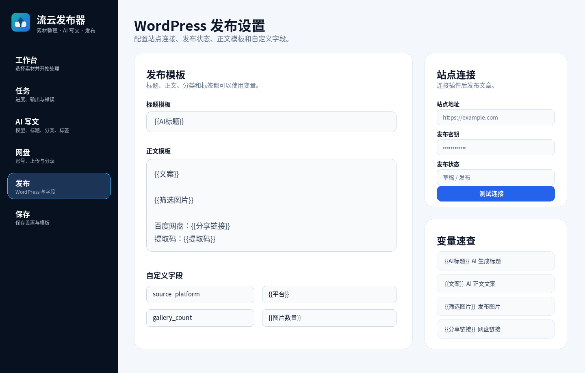
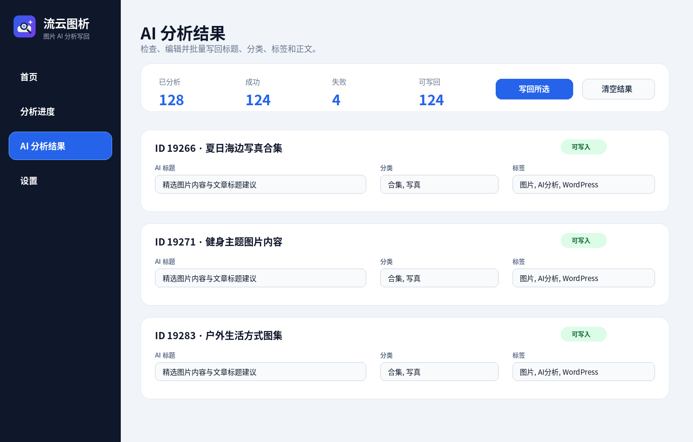

# 流云发布器 / 流云图析

面向 WordPress 内容发布流程的桌面工具套装。

- **流云发布器**：素材整理、网盘分享、AI 写文、WordPress 发布准备。
- **流云图析**：读取 WordPress 文章图片，调用 AI 生成标题、分类、标签、正文，并支持写回文章。
- **WordPress 插件**：`Haidai Secure Publisher`，为两个桌面软件提供安全发布与写回接口。

> 本仓库是公开下载页，仅提供说明、截图、校验文件和 Release 安装包；不包含本地配置、密钥、账号数据或私有素材。

## 软件截图

### 流云发布器



### 流云图析



## 下载

请到右侧或下方 **Releases** 页面下载最新版：

- `流云发布器-windows-x64-0.1.0.zip`
- `流云发布器-mac-x64-0.1.0.zip`
- `流云发布器-mac-arm64-0.1.0.zip`
- `流云图析-windows-x64-0.1.0.zip`
- `流云图析-mac-x64-0.1.0.zip`
- `流云图析-mac-arm64-0.1.0.zip`
- `haidai-secure-publisher-0.2.3.zip`
- `SHA256SUMS.txt`

## 功能概览

### 流云发布器

- 批量处理本地素材目录。
- 支持压缩、截图、人工筛图/打码等发布前整理流程。
- 支持 AI 生成标题、分类、标签和正文草稿。
- 支持百度网盘上传、分享链接与提取码变量。
- 支持 WordPress 发布模板变量，例如：
  - `{{AI标题}}`
  - `{{文案}}`
  - `{{筛选图片}}`
  - `{{分享链接}}`
  - `{{提取码}}`

### 流云图析

- 从 WordPress 读取文章与图片。
- 按分类、状态、关键词筛选文章。
- 调用 AI 分析图片内容。
- 生成并可编辑：标题、分类、标签、正文。
- 支持选择字段写回，支持覆盖/追加正文。
- 分析进度和写回结果可视化显示。

### WordPress 插件

- 为桌面软件提供安全接口。
- 支持文章发布、媒体上传、分类读取、文章读取和 AI 字段写回。
- 写回 AI 字段时会保留原文章状态，不会误改发布/草稿状态。

## 基本使用流程

1. 在 WordPress 后台安装 `haidai-secure-publisher-0.2.3.zip` 插件。
2. 在插件设置中配置安全密钥。
3. 打开桌面软件，在设置中填写 WordPress 站点地址和相同密钥。
4. 使用 **流云发布器** 处理素材并准备发布，或使用 **流云图析** 分析已有 WordPress 文章图片并写回字段。

## 校验文件

下载后可以使用 `SHA256SUMS.txt` 校验压缩包完整性。

```text
请以 Release 附件中的 SHA256SUMS.txt 为准。
```

## 注意事项

- Windows 版为 x64。
- macOS 分为 Intel x64 和 Apple Silicon arm64。
- 首次运行 macOS 未签名应用时，可能需要在系统设置中允许打开。
- AI 分析能力取决于本地 Ollama 或外部 AI 接口配置。
- 请不要把 WordPress 插件密钥公开到截图、日志或网页中。

## 版本

当前公开版：`v0.1.0`
